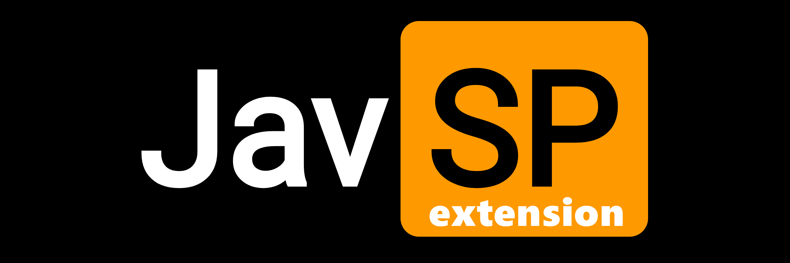

# JavSP Extension

<p align="center">
  
</p>

<p align="center">
  <strong>基于原版 JavSP 重构升级的 AV 元数据刮削与本地文件整理工具</strong><br>
  浏览器扩展（防风控/爬虫/过盾/UI） + 本地服务（文件扫描/NFO生成/海报裁剪/整理归档）
</p>

<p align="center">
  <a href="./LICENSE"></a>
  <a href="https://github.com/996icu/996.ICU/blob/master/LICENSE_CN"></a>
  
  
  
</p>

---

## 简介与背景

原项目 [JavSP](https://github.com/Yuukiy/JavSP) 是一个用 Python 编写的自动化影视元数据刮削与本地文件整理工具。随着目标站点反爬策略升级（Cloudflare 人机验证、图床防盗链、Cookie 访问限制等），原项目的纯 Python 架构已难以直接稳定抓取，甚至几乎无法使用。

本项目将其重构为 **“浏览器扩展 + 本地/远程服务”** 的双端协作模式：

- **前端浏览器扩展**：负责全部网络请求与界面交互。直接复用真实浏览器的网络环境与登录态进行数据爬取和防盗链处理。**爬虫解析逻辑由原项目的 Python 实现移植而来（其中 AirAV 针对当前站点现状进行了重写）**。
- **Python 本地服务端**：负责所有本地文件操作。**服务端的行为模式基本复刻原项目**，包括番号识别推断、分片合并、NFO 节点构造、海报裁剪、角标水印合成以及目录重命名归档。前端不直接操作本机文件，服务端不直接访问外部数据源站。

---

## 主要功能

- **番号推断与分片识别**：自动从文件名提取番号（支持普通番号、FC2、Heydouga、CID 等），智能识别并合并分片（CD1/CD2），支持识别 `-C`（内嵌字幕）与 `-U`（无码流出）。
- **多站点数据汇总**：目前支持 JavBus（封面、剧照）、JavDB（分类、社区评分）、AirAV（优质中文标题和剧情简介）等数据源。
- **标题与剧情简介翻译**：支持接入 OpenAI、Claude、Google Translate、Bing、Baidu 等翻译服务。
- **元数据与图像处理**：生成兼容 Kodi / Jellyfin / Emby 的 `.nfo` 文件；横版封面自动按 2:3 比例居中裁剪为竖版海报（`poster.jpg`），原图保存为 `fanart.jpg`，支持叠加水印角标。对于大厂影片的标准尺寸海报，相对原版重新优化了剪裁算法。
- **归档整理与硬链接**：支持按模板格式化重命名与分类存放，支持普通文件移动或硬链接（做种不占额外磁盘空间）。
- **历史遗留问题处理工具（新增）**：
  针对原项目历史整理产生的遗留问题，在工作台中新增了批量维护工具：
  - **NFO 标签清理**：原版生成的 NFO 中常包含失效的预告片切片链接（导致 Jellyfin 播放卡死）及外部头像外链（并发拉取导致前端卡顿）。该工具可批量扫描现有 `.nfo`，一键清理 `<trailer>` 视频流与 `<actor><thumb>` 外部图床链接。
  - **海报批量重裁剪**：原版生成的竖版海报部分存在比例偏差或人物切偏问题。该工具可扫描已整理目录下的 `fanart` 原图，按优化后的居中比例批量重新裁剪生成 `poster.jpg`。

> 当前项目暂时只支持 javbus, javdb, airav 三个站点。
---

## 快速上手

本项目分为浏览器扩展与本地服务两部分，需要两者同时配合使用。

### 1. 浏览器扩展(Chrome extension)
扩展端负责完成数据请求、爬虫、数据清洗、反爬虫、前端UI和与本地服务通信等工作。

#### 1.1 下载编译好的扩展加载（尚未发布）
1. 从 [Releases](https://github.com/ylytne/JavSP-extension/releases) 页面下载最新的预编译包 `javsp-extension.zip` 并解压；
2. 打开 Chrome 浏览器，在地址栏输入 `chrome://extensions/` 并回车；
3. 开启右上角的 **“开发者模式”**；
4. 点击左上角的 **“加载已解压的扩展程序”**，选中解压出的扩展目录进行加载。

#### 1.2 自编译扩展
适合想要自行构建或二次开发（需 Node.js 18+）：
```bash
git clone https://github.com/ylytne/JavSP-extension.git
cd JavSP-extension/extension
npm install
npm run build
```
编译成功后，按照 1.1 的方法在 Chrome 中加载 `extension/dist` 目录。

---

### 2. 服务端运行

服务端负责处理本地磁盘读写、NFO 生成及文件归档。

#### 2.1 本地二进制文件运行（尚未发布）
1. 从 [Releases](https://github.com/ylytne/JavSP-extension/releases) 页面下载适合您操作系统的独立可执行文件压缩包（如 Windows 的 `javsp-backend-windows-x64.zip`、Linux 的 `javsp-backend-linux-x64.tar.gz` 等）；
2. 解压后直接运行 `javsp-backend`；
3. 程序首次启动会自动在当前目录生成默认配置文件 `config.yml`，服务默认监听端口为 `8765`。

#### 2.2 源代码运行服务端
要求 Python 3.12+ 和 uv：
```bash
cd backend
uv sync
cp config.default.yml config.yml
uv run python -m app.main
```
访问 `http://127.0.0.1:8765/api/ping` 验证服务启动正常。

#### 2.3 Docker 部署服务端（NAS / 服务器）
> 没有NAS实体机测试，暂不保证可用性。

适合群晖、威联通、Unraid 等 NAS 或无头 Linux 服务器部署：
```bash
cd backend
cp .env.example .env
# 按需在 .env 中配置宿主机媒体路径 JAVSP_MEDIA_DIR 与端口
docker compose up -d
```
安全起见， docker 部署必须配置安全密钥，系统会在第一次启动时自动生成，显示在终端。请复制保存，之后可自行修改。
启动后可通过 CLI 查看自动生成的安全令牌 (API Token)：
```bash
docker exec javsp-backend python -m app.cli token
```

---

### 3. 使用流程

1. **配对连接**：点击 Chrome 工具栏中的扩展图标打开侧边栏，或右键选择 **“打开 JavSP 全功能工作台”**，在连接弹窗中填入服务端地址（本机为 `http://127.0.0.1:8765`）与 API Token 保存；
2. **扫描文件**：在扩展界面中输入待整理文件夹路径，点击 **“开始扫描”**；
3. **确认整理**：检查识别出的影片番号与属性（支持手动微调），点击 **“开始整理”**，由扩展端并发爬取翻译后推送到服务端完成落盘归档。

---

## 配置文件说明

- `config.default.yml`：默认配置模板（不要直接修改，随 Git 更新）。
- `config.yml`：用户本地配置文件。程序启动时会将自定义配置与默认配置进行深度合并。
- 也可以直接在扩展工作台的 **设置** 页面中在线修改并热生效。

---

## 许可与致谢

本项目基于 **[GPL-3.0](https://www.gnu.org/licenses/gpl-3.0.html)** 与 **[Anti-996 License](https://github.com/996icu/996.ICU/blob/master/LICENSE_CN)** 开源。此外，如果你使用此项目，表明你还额外接受以下条款：
- 本项目仅供学习交流使用。
- 使用过程中请遵守当地法律法规。

特别鸣谢原项目 [Yuukiy/JavSP](https://github.com/Yuukiy/JavSP) 奠定的基础。
